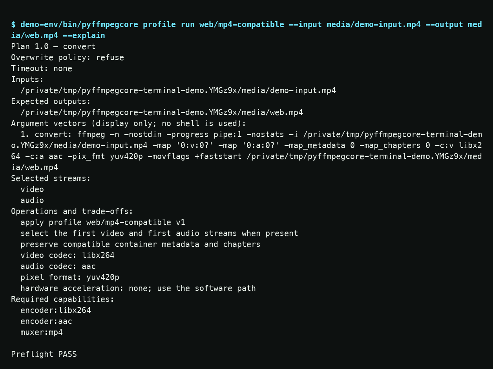

---
hide:
  - toc
  - navigation
  - path
---

  <section class="pfc-hero" aria-labelledby="pfc-hero-title">
    

      
Local media automation / signal online

      <h1 id="pfc-hero-title">FFmpeg jobs you can explain.</h1>
      

        <a class="pfc-button" href="quickstart/">Prove it in five minutes</a>
        <a class="pfc-button pfc-button--ghost" href="terminal-demo/">Watch the real 0.2.2 run</a>
        <a class="pfc-button pfc-button--ghost" href="recipes/">Pick a real recipe</a>
      

      

        Preflight the machine. Preview the exact plan. Run a maintained workflow.
        Keep a privacy-redacted receipt. PyFFmpegCore turns fragile media commands
        into repeatable operations for the terminal, Python, and CI.
      

    

    

      <figure class="pfc-terminal-capture">
        
        <figcaption>
          Real terminal capture / public PyPI 0.2.2
          <a href="terminal-demo/">Watch the complete run →</a>
          <button class="pfc-copy" type="button" data-pfc-copy aria-label="Copy the public PyPI install command" aria-live="polite">Copy public install</button>
        </figcaption>
      </figure>
    

  </section>

  <noscript>JavaScript is optional. Use the install command in the five-minute guide.</noscript>

  <section class="pfc-metrics" aria-label="Supported environments and privacy properties">
    
<strong>3</strong>operating systems

    
<strong>5</strong>Python versions

    
<strong>0</strong>default telemetry

    
<strong>0.2.2</strong>signed public beta

  </section>

  <section class="pfc-live-proof" aria-labelledby="live-proof-title">
    
89.5<small>seconds</small>

    

      
Public PyPI 0.2.2 recording / no staged output

      <h2 id="live-proof-title">Watch a real 0.2.2 run.</h2>
      
The 89.5-second capture shows a fresh install, capability scan, synthetic smoke test, explained plan, progress, probed output, and validated receipt from the current signed public release.

      

        <a class="pfc-button" href="terminal-demo/">Open the terminal proof</a>
        <a class="pfc-button pfc-button--ghost" href="https://github.com/OthmaneBlial/pyffmpegcore/releases/tag/v0.2.2">Inspect the signed release</a>
      

    

  </section>

  <section class="pfc-section" aria-labelledby="flow-title">
    

      <h2 id="flow-title">One job. Four proofs.</h2>
      

        Most wrappers start at execution. PyFFmpegCore starts one step earlier and
        leaves evidence one step later, so the same intent is reviewable before and
        after FFmpeg touches a file.
      

    

    

      <article class="pfc-stage">
        01 / Preflight
        <h3>Know the machine</h3>
        
Resolve binaries, encoders, filters, muxers, protocols, streams, destination, and disk requirements.

      </article>
      <article class="pfc-stage">
        02 / Plan
        <h3>See the exact work</h3>
        
Inspect a deterministic argument vector and human explanation without mutating the filesystem.

      </article>
      <article class="pfc-stage">
        03 / Run
        <h3>Control failure</h3>
        
Use explicit overwrite, timeout, cancellation, cleanup, progress, and stable exit-code policies.

      </article>
      <article class="pfc-stage">
        04 / Receipt
        <h3>Keep the evidence</h3>
        
Record redacted plans, tool versions, probes, elapsed results, and output facts without uploading media.

      </article>
    

  </section>

  <section class="pfc-section" aria-labelledby="proof-title">
    

      <h2 id="proof-title">Measured. Not mocked.</h2>
      

        The 19 September replay used generated first-party fixtures. Commands,
        probes, receipts, checksums, and the size tradeoff are open for inspection.
      

    

    

      <article class="pfc-proof">
        Web video / compatibility cost
        <strong>+78.2%</strong>
        
2,141,004-byte VP9 WebM to a 3,814,506-byte H.264/AAC MP4. Wider playback compatibility can increase size.

        <a href="evidence/#replay-on-19-september-2026">Inspect the replay →</a>
      </article>
      <article class="pfc-proof">
        Exact-size / output
        <strong>248,417 B</strong>
        
A 4,042,503-byte source compressed below a strict 256 KiB target.

        <a href="evidence/#replay-on-19-september-2026">Inspect the replay →</a>
      </article>
      <article class="pfc-proof">
        Podcast / measured loudness
        <strong>−16.2 LUFS</strong>
        
A −22.0 LUFS WAV normalized toward the declared −16.0 LUFS speech target.

        <a href="evidence/#replay-on-19-september-2026">Inspect the replay →</a>
      </article>
    

  </section>

  <section class="pfc-section" aria-labelledby="lanes-title">
    

      <h2 id="lanes-title">Choose your lane.</h2>
      
Start from the outcome you need. Every lane reaches the same planner, preflight, runner, and receipt model.

    

    

      <article class="pfc-lane">
        <h3>One useful file</h3>
        
Convert a web video, fit an upload limit, normalize speech, burn subtitles, extract audio, or make thumbnails.

        <a href="recipes/">Open the recipe index →</a>
      </article>
      <article class="pfc-lane">
        <h3>Repeatable pipeline</h3>
        
Validate, visualize, run, cache, and resume strict JSON or TOML DAGs without embedding raw shell strings.

        <a href="pipelines/">Build a pipeline →</a>
      </article>
      <article class="pfc-lane">
        <h3>Automation surface</h3>
        
Use the same typed engine from Python, a digest-pinned GitHub Action, or the multi-architecture container.

        <a href="reference/python-api/">Open the Python API →</a>
      </article>
    

  </section>

  <section class="pfc-section" aria-label="Tool selection guidance">
    

      <h2>Know when not to use it.</h2>
      

        

          Raw FFmpeg is better when you already own the exact argument vector.
          Graph builders are better for arbitrary filter graphs. PyAV is better for
          direct packet and frame access. PyFFmpegCore owns the repeatable task layer:
          diagnostics, plans, execution policy, and proof.
        

        <a href="comparison/">Read the factual comparison →</a>
      

    

  </section>

