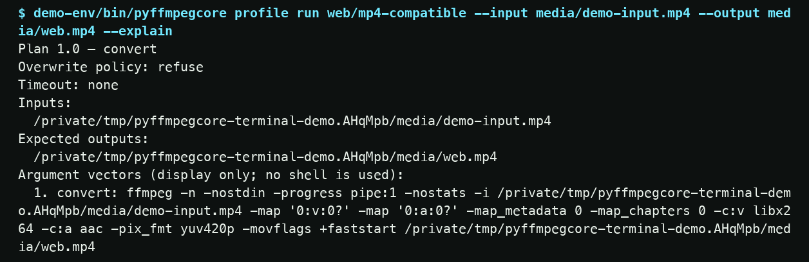
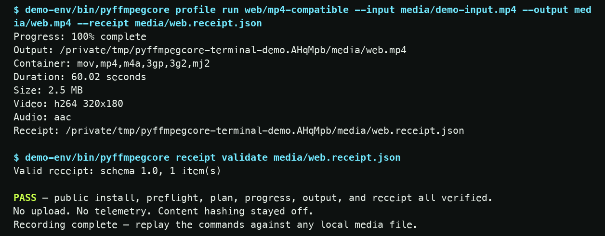

# A public 0.3.3 install. 64.3 real seconds.

Recorded on 24 September 2026 from a fresh virtual environment on macOS arm64,
Python 3.14.6, and FFmpeg 9.0.1. The capture installs the exact public `0.3.3`
wheel from PyPI, creates synthetic media, previews a web profile, encodes a
result, probes its streams, and validates its receipt. The repository
validator measured **64.3 seconds** and rejected private home paths.

<div class="pfc-demo-ledger" aria-label="Terminal demonstration facts">
  <div><span>Artifact</span><strong>PyPI 0.3.3</strong></div>
  <div><span>Duration</span><strong>64.3 s</strong></div>
  <div><span>Host</span><strong>macOS arm64</strong></div>
  <div><span>Media</span><strong>Synthetic / local</strong></div>
</div>

## Frames from the recording

The frames are rendered from the original cast without changing its text. The
[frame manifest](assets/terminal-demo-v0.3.3.frames.json) records source and
image checksums, event times, and rendering details.



*Plan captured at 39.651 seconds, before the output is written.*



*Result captured at 64.304 seconds after the local receipt passed validation.*

## Inspect or replay the evidence

- [Download the original asciicast](assets/terminal-demo-v0.3.3.cast)
- [Read the complete accessible transcript](assets/terminal-demo-v0.3.3.txt)
- [Inspect the signed GitHub release, checksums, and artifact report](https://github.com/OthmaneBlial/pyffmpegcore/releases/tag/v0.3.3)
- [Inspect the exact publication and six-cell public-install workflow](https://github.com/OthmaneBlial/pyffmpegcore/actions/runs/35992506546)
- [Open the public PyPI files](https://pypi.org/project/pyffmpegcore/0.3.3/)
- [Verify the wheel Trusted Publisher attestation](https://pypi.org/integrity/pyffmpegcore/0.3.3/pyffmpegcore-0.3.3-py3-none-any.whl/provenance)
- [Verify the source distribution Trusted Publisher attestation](https://pypi.org/integrity/pyffmpegcore/0.3.3/pyffmpegcore-0.3.3.tar.gz/provenance)
- [Inspect the archived 0.3.2 recording](assets/terminal-demo-v0.3.2.cast)
- [Inspect the archived 0.3.1 recording](assets/terminal-demo-v0.3.1.cast)
- [Inspect the archived 0.3.0 recording](assets/terminal-demo-v0.3.0.cast)
- [Inspect the archived 0.2.2 recording](assets/terminal-demo-v0.2.2.cast)

The published wheel is 101,753 bytes with SHA-256
`872279bca79dbbf99a725dc0d3c2d682199852f9ce2d09e7d2abb7ea46b13e7c`. The
342,712-byte source distribution has SHA-256
`71f22070edfeccc3bdc0dfb0f0c94cacc603c341a6ad9ea509d21515f87c4438`. The
release `SHA256SUMS` and PyPI JSON match both artifacts.

To replay the cast with the open-source asciinema client:

```bash
asciinema play terminal-demo-v0.3.3.cast
```

To validate the recording and regenerate its transcript:

```bash
python scripts/validate_terminal_demo.py \
  --cast docs/assets/terminal-demo-v0.3.3.cast \
  --expected-version 0.3.3 \
  --transcript /tmp/terminal-demo-v0.3.3.txt
```

## What the recording proves

1. The installed package came from the public PyPI wheel, checked by SHA-256.
2. `doctor` resolved the real FFmpeg and FFprobe binaries and their capabilities.
3. `smoke-test` generated local synthetic media and verified a thumbnail.
4. `--explain` showed the argument plan and preflight without writing output.
5. The run emitted progress, produced an H.264/AAC MP4, probed its streams, and
   validated the schema 1.0 receipt.

The fixture and output are synthetic. They do not establish quality on user
media or support for every FFmpeg build. No personal media or telemetry was
involved. See the [compatibility policy](COMPATIBILITY.md) and [measured recipe
evidence](evidence.md).
