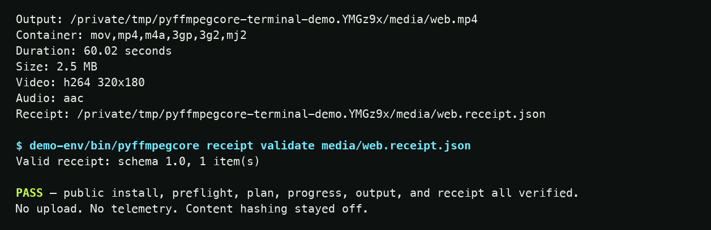

# A public install. 89.5 real seconds.

This asciicast was recorded on 19 September 2026 from a fresh virtual
environment on macOS arm64, Python 3.14.6, and FFmpeg 9.0.1. It downloaded
`pyffmpegcore==0.2.2` from public PyPI, generated synthetic media locally,
previewed the web profile, encoded the result, probed its streams, and
validated its receipt. The repository's recording validator measured **89.5
seconds** and rejected private home-directory paths.

<div class="pfc-demo-ledger" aria-label="Terminal demonstration facts">
  <div><span>Artifact</span><strong>PyPI 0.2.2</strong></div>
  <div><span>Duration</span><strong>89.5 s</strong></div>
  <div><span>Media</span><strong>Synthetic</strong></div>
  <div><span>Result</span><strong>PASS</strong></div>
</div>

## Frames from the real terminal

The images below render two frames from the validated asciicast. The second
is cropped to the output and receipt; no command text or measured fact was
added. The complete, timestamped cast and accessible transcript are linked
below.


The plan exposes H.264/AAC, `yuv420p`, the two selected streams, and the
required encoders and MP4 muxer before the file is written.
[Open the plan frame at full resolution](assets/terminal-plan-v0.2.2.png).



The output was a 60.02-second H.264/AAC MP4 reported as 2.5 MB. The synthetic
input and output lived in the recorder's temporary directory; the recording
and transcript preserve the console evidence, not a downloadable media file.
[Open the result frame at full resolution](assets/terminal-result-v0.2.2.png).

## Inspect or replay the evidence

- [Download the original asciicast](assets/terminal-demo-v0.2.2.cast)
- [Read the complete accessible transcript](assets/terminal-demo-v0.2.2.txt)
- [Inspect frame timestamps, crops, renderer, and SHA-256 hashes](assets/terminal-demo-v0.2.2.frames.json)
- [Inspect the exact public release workflow](https://github.com/OthmaneBlial/pyffmpegcore/actions/runs/32955455841)
- [Inspect the signed release and checksums](https://github.com/OthmaneBlial/pyffmpegcore/releases/tag/v0.2.2)
- [Inspect the archived `0.2.1` cast](assets/terminal-demo-v0.2.1.cast)

To replay the cast locally with the open-source asciinema client:

```bash
asciinema play terminal-demo-v0.2.2.cast
```

To verify the recording and regenerate its transcript from the repository:

```bash
python scripts/validate_terminal_demo.py \
  --cast docs/assets/terminal-demo-v0.2.2.cast \
  --expected-version 0.2.2 \
  --transcript /tmp/terminal-demo-v0.2.2.txt
```

## What the recording proves

1. The package came from public PyPI rather than the repository checkout.
2. `doctor` resolved the actual FFmpeg and FFprobe binaries and indexed their
   capabilities.
3. `smoke-test` generated and verified local media without a personal file.
4. `--explain` showed the argument vector and trade-offs before mutation.
5. The run emitted progress, probed the output, and wrote a receipt.
6. The receipt validator accepted schema 1.0 and its single item.

This generated fixture does not establish quality on user media, support for
every FFmpeg build, or a size reduction. See the [compatibility
policy](COMPATIBILITY.md) and [measured recipe evidence](evidence.md).
